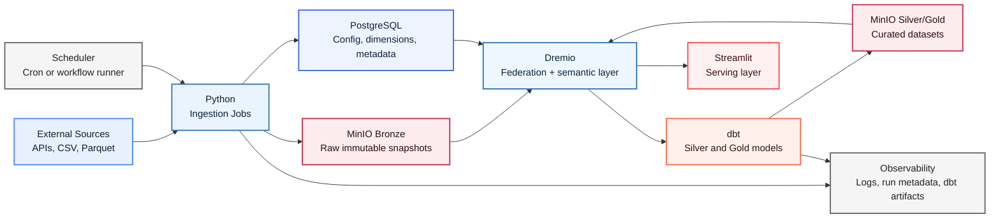

# Football Betting Data Platform

## Goal

This project is a portfolio-ready data engineering platform for football analytics and betting use cases.

The main goal is to show how raw football data can be:

1. collected from external sources,
2. stored safely in a raw data layer,
3. transformed into trusted analytics datasets,
4. exposed through a semantic layer,
5. consumed by an application for analysis and decision support.

This is not only a football project. It is a data engineering project demonstrated with football data.

## Main Business Question

How do we build a reliable data platform that transforms raw football data into curated datasets that can support:

- match analysis,
- team and player performance tracking,
- feature engineering for betting models,
- interactive dashboards and portfolio demos.

## What This Project Demonstrates

- raw-to-curated data platform design
- cloud-style object storage architecture
- metadata and run tracking
- transformation and testing with dbt
- semantic query access through Dremio
- separation of ingestion, storage, transformation, and serving layers

## Architecture

<p align="center">
  
  
  
  
  
  
</p>



## Tooling Used

| Layer | Tool | Why it is used |
|---|---|---|
| Ingestion |  | Flexible jobs for API calls, file ingestion, validation, and data loading |
| Raw storage |  | S3-compatible object storage for immutable raw datasets |
| Control plane |  | Stores dimensions, configuration, run metadata, and data quality results |
| Semantic layer |  | Federates storage systems and gives the app stable analytical access |
| Transformation |  | Builds tested Silver and Gold models and documents lineage |
| Serving |  | Displays curated datasets in a demo-ready application |

## Scheduled Refresh

The ingestion job is designed to run automatically **4 times per day**.

Why this matters:

- football match data and league-table inputs change during the day,
- the project needs a clear scheduling/orchestration story,
- a fixed schedule shows operational thinking without adding unnecessary orchestration tools too early.

Current schedule:

- `00:15 UTC`
- `06:15 UTC`
- `12:15 UTC`
- `18:15 UTC`

The scheduled pipeline refreshes:

- raw Bronze snapshots in MinIO
- ingestion run metadata in PostgreSQL
- the Dremio semantic raw dataset
- the Silver Parquet dataset in MinIO
- dbt staging and Gold models

Implementation details are documented in:

- [scheduled-ingestion.md](/Users/valtercheque/Documents/Portfolio/Football-Betting-DE/docs/architecture/scheduled-ingestion.md)

## Data Goal

The data goal is to turn messy football data into trusted datasets for analysis and betting-oriented feature generation.

The platform should support data such as:

- fixtures and match schedules
- match results
- team information
- player statistics
- league tables
- injuries and squad availability
- head-to-head history
- odds and bookmaker market data

## Data Layers

### 1. Bronze Layer

Purpose: store raw data exactly as received.

Characteristics:

- immutable snapshots
- versioned by ingestion run
- no business transformations
- useful for audit, replay, and debugging

Example path:

```text
s3://football/bronze/source=<source>/entity=<entity>/ingest_date=YYYY-MM-DD/run_id=<uuid>/...
```

Example data in Bronze:

- raw API JSON response for fixtures
- CSV file with team statistics
- Parquet file with player events
- original odds feed snapshot

### 2. Silver Layer

Purpose: clean and standardize the raw data.

Characteristics:

- normalized schemas
- standardized dates and types
- deduplicated records
- mapped team and league identifiers
- persisted as curated Parquet artifacts in MinIO

Example data in Silver:

- one clean match table with standard columns
- team names mapped to a canonical team ID
- player statistics with corrected data types
- cleaned odds records from multiple sources

### 3. Gold Layer

Purpose: expose business-ready datasets for analytics and app consumption.

Characteristics:

- aggregated
- use-case oriented
- stable for dashboards and modeling

Example Gold datasets:

- standings
- head-to-head aggregates
- `gold_h2h_context`
- `gold_match_context`
- player form metrics
- injury impact summaries
- betting feature tables

## Step-by-Step Process

## Step 1. External Sources

Goal: collect football data from outside systems.

Possible inputs:

- REST APIs
- CSV files
- Parquet files
- static reference files

Example data collected:

- fixture list for a league
- historical match results
- player performance stats
- bookmaker odds

Output of this step:

- raw source payloads ready for ingestion

## Step 2. Python Ingestion Jobs

Goal: extract data from sources and load it into the platform in a controlled way.

What happens here:

- call APIs or read files
- validate the basic structure
- assign a `run_id`
- compute checksums and row counts
- write raw files to Bronze
- register metadata in PostgreSQL

Data handled in this step:

- unmodified source payloads
- ingestion metadata such as source, entity, run time, checksum, and row count

Output of this step:

- raw files in MinIO Bronze
- metadata rows in PostgreSQL
- local staged files for replayable uploads

## Step 3. MinIO Bronze

Goal: keep the original data as the system of record for datasets.

What is stored:

- raw JSON
- raw CSV
- raw Parquet
- files partitioned by source, entity, date, and run

Why this matters:

- makes the pipeline reproducible
- supports reprocessing
- gives a clear audit trail

Output of this step:

- immutable raw storage ready to be queried or transformed

## Step 4. PostgreSQL Dimensions and Metadata

Goal: store structured operational data that should not live as raw files.

What is stored:

- `dim_league`
- `dim_team`
- `team_alias_map`
- `source_config`
- `pipeline_run`
- `file_manifest`
- `dq_results`

Why this matters:

- stores canonical IDs
- tracks every ingestion run
- keeps quality and operational metadata queryable

Output of this step:

- trusted reference tables and operational tracking tables

## Step 5. Dremio Federation and Semantic Layer

Goal: create a single analytical access layer across object storage and relational metadata.

What happens here:

- connect Dremio to MinIO
- connect Dremio to PostgreSQL
- expose semantic datasets and views

Data handled in this step:

- Bronze, Silver, and Gold objects in MinIO
- dimensions and metadata in PostgreSQL

Why this matters:

- hides storage complexity from the app
- gives stable datasets for downstream consumption

Output of this step:

- semantic views that can be consumed by dbt and Streamlit
- stable datasets such as `semantic.raw_matches_odds` and `semantic.silver_matches`

## Step 6. dbt Transformations

Goal: convert raw and semi-structured data into tested analytical models.

What happens here:

- build staging models on top of semantic Silver datasets
- create Gold marts
- run data tests
- generate documentation and lineage

Data handled in this step:

- raw match, player, odds, and team data
- standardized entities and curated aggregates

dbt quality checks:

- `not_null`
- `unique`
- `accepted_values`
- relationships
- freshness

Output of this step:

- tested Silver and Gold datasets
- dbt documentation artifacts

## Step 7. MinIO Silver and Gold

Goal: persist transformed datasets as reusable analytics assets.

What is stored:

- `silver_matches` as a curated Parquet dataset
- future analytical marts and feature tables

Why this matters:

- separates raw storage from curated storage
- improves reproducibility and reuse
- supports portfolio storytelling around data maturity

Output of this step:

- curated Parquet or Iceberg datasets for analytics use

## Step 8. Streamlit Serving Layer

Goal: present the curated data in an application.

What happens here:

- query Dremio views
- render dashboards and exploratory screens
- display betting-related scenario analysis

What should not happen here:

- heavy transformations
- source-specific cleaning logic
- business logic that belongs in dbt

Data handled in this step:

- curated Gold datasets only

Output of this step:

- interview-ready dashboards and demos

## Step 9. Scheduling and Observability

Goal: make the platform reliable and explainable.

What happens here:

- jobs run on a schedule
- logs are collected
- ingestion runs are tracked
- dbt artifacts are stored
- freshness and test results are monitored

Data handled in this step:

- run logs
- execution timestamps
- pipeline statuses
- quality results

Output of this step:

- operational visibility into the pipeline

## End-to-End Data Story

The end-to-end flow is:

1. football data is collected from APIs or files,
2. Python ingestion stores the raw payloads in MinIO Bronze,
3. ingestion metadata and dimensions are stored in PostgreSQL,
4. the latest successful raw run is published as `silver_matches` in MinIO,
5. Dremio connects Bronze, Silver, and PostgreSQL into one analytical access layer,
6. dbt transforms Silver data into business-ready Gold datasets,
7. Streamlit consumes curated views for dashboards and demos,
8. scheduling and observability make the platform repeatable and explainable.

## Why This Design Is Strong for Interviews

- it shows clear separation of concerns
- it uses modern data engineering patterns
- it demonstrates lineage and data quality thinking
- it avoids putting transformation logic in the application layer
- it is realistic enough for production discussion, but small enough for a portfolio project

## Planned Build Order

1. Define the repository structure and architecture decisions.
2. Stand up local infrastructure with Docker Compose.
3. Implement one ingestion pipeline into Bronze.
4. Create PostgreSQL metadata tables.
5. Connect MinIO and PostgreSQL to Dremio.
6. Add dbt staging, Silver, and Gold models.
7. Connect Streamlit to curated datasets.
8. Add scheduling, logging, and data quality reporting.

## Success Criteria

This project is successful when it can clearly demonstrate:

- where the data comes from,
- how the raw data is stored,
- how the data is cleaned and modeled,
- how quality is checked,
- how curated datasets are served to an app,
- how each layer has a clear responsibility.
