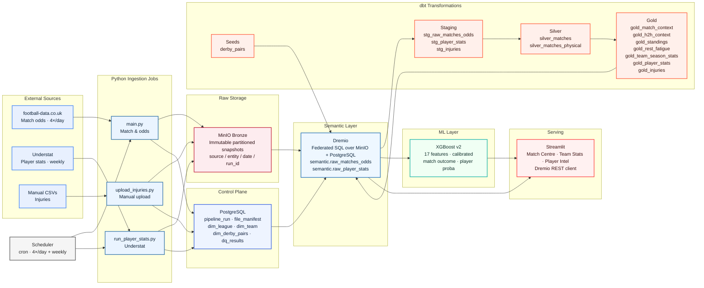

# Football Betting Data Platform

A data engineering platform that ingests raw football data from multiple sources, transforms it through a medallion pipeline, and serves curated analytics to a Streamlit application backed by XGBoost match prediction models.

<p align="center">
  
  
  
  
  
  
  
</p>

---

## Architecture



---

## Technology Stack

| Layer | Tool | Role |
|---|---|---|
| Ingestion | Python + `aiohttp` | Async jobs for football-data.co.uk (CSV) and Understat (async HTML scraping). Assigns `run_id`, computes checksums, registers metadata before any data reaches storage. |
| Raw storage | MinIO (S3-compatible) | Immutable Bronze snapshots partitioned by `source / entity / ingest_date / run_id`. Append-only — no file is ever overwritten or deleted. Enables full pipeline replay. |
| Control plane | PostgreSQL | Holds dimensions (`dim_league`, `dim_team`, `dim_derby_pairs`), every ingestion run record (`pipeline_run`, `file_manifest`), source configuration, and data quality results. Structured metadata that does not belong as flat files. |
| Semantic layer | Dremio OSS | Federates MinIO and PostgreSQL into a single SQL surface. Dremio owns the virtual view definitions (`semantic.raw_matches_odds`, `semantic.raw_player_stats`) regenerated by `sync_semantic_layer.py` after each ingestion run. The app and dbt query exclusively through Dremio, never directly against storage. |
| Transformation | dbt | Staging → Silver → Gold model chain with `not_null`, `unique`, `accepted_values`, and relationship tests. Owns `silver_matches` as the canonical match record. Gold models are pushed back into Dremio as queryable views. Seeds manage static reference data (`derby_pairs`). |
| ML model | XGBoost + scikit-learn | Multi-class classifier (`H/D/A`) trained in-process at app load time from Dremio Gold data. 17-feature vector with Platt sigmoid calibration (`CalibratedClassifierCV`) on a time-ordered 20% holdout. Separate Poisson models per player for goal and card probabilities. |
| Containerisation | Docker Compose | Single `docker compose up` starts Postgres, MinIO, Dremio, and Streamlit. Ingestion and dbt runners use the `jobs` profile; the app uses the `app` profile. No Kubernetes or cloud provider required. |
| Scheduling | cron (inside Docker) | Match/odds pipeline runs at 00:15, 06:15, 12:15, and 18:15 UTC. Understat player stats run weekly on Sundays at 02:00 UTC. Both jobs run the full ingest → sync → dbt chain. |
| Serving | Streamlit | Reads exclusively from `semantic.gold_*` views via Dremio's REST Jobs API. Three tabs: Match Centre (predictions + EV framework), Team Stats (seasonal breakdown), Player Intel (scoring/card probabilities from Poisson). |

---

## Technical Decisions

### Medallion pipeline with Dremio as the federation point

The Bronze/Silver/Gold separation exists to isolate concerns: ingestion writes raw files, transformation owns the cleaning and aggregation logic, and the app reads only curated output. Dremio is the integration point between object storage (MinIO), relational metadata (PostgreSQL), and the dbt-built Gold layer. This means the app has a single stable SQL interface regardless of where or how data is physically stored.

### MinIO over a managed data warehouse

MinIO keeps the stack self-contained inside Docker. It speaks S3 natively so the ingestion code uses `boto3`, Dremio connects via S3 source, and the path from local development to a cloud deployment requires only credential swaps. A managed warehouse would be faster to query but would introduce cloud costs and external dependencies that complicate reproducibility for a portfolio context.

### PostgreSQL for metadata and dimensions, not for analytical queries

PostgreSQL holds structured operational data: ingestion run records, checksums, row counts, data quality results, and dimension tables. It is the control plane. Analytical queries never go directly to PostgreSQL — they always go through Dremio. This separation means the metadata database can stay small and OLTP-optimised while Dremio handles columnar scan patterns over MinIO files.

### dbt for all transformation logic

Transformation logic lives exclusively in dbt, not in the ingestion jobs or the Streamlit app. This enforces the principle that the app is a consumer, not a transformer. Every model has tests. Lineage is documented. Gold views are regenerated deterministically from versioned SQL — no ad-hoc Python that silently changes behaviour between runs.

### Derby pairs as a seeded reference table

Same-city rivalry pairs (`dim_derby_pairs` in PostgreSQL, `seeds/derby_pairs.csv` materialised into Dremio via `dbt seed`) are stored as structured data rather than hardcoded constants. The Python ML layer loads them from the semantic layer at startup and falls back to a hardcoded frozenset when the database is unavailable. This pattern keeps data in the data platform and keeps the ML code stateless and testable.

### XGBoost v2 with Platt calibration

The match model uses XGBoost (`multi:softprob`) rather than logistic regression or a neural network because it handles the nonlinear interaction between features like `form_points_gap` and `rest_gap` without extensive feature engineering, tolerates missing values natively, and is fast enough to retrain at app load time from a few thousand rows. Probability calibration with `CalibratedClassifierCV` (sigmoid, prefit, time-ordered 20% holdout) corrects the raw XGBoost softmax outputs, which tend to be overconfident, into probabilities that are reliable enough for an expected-value betting framework.

### Streamlit over a BI tool

Streamlit allows the prediction logic (XGBoost inference, EV calculation, lineup adjustments) to live in the same Python process as the UI, without a separate API layer. A BI tool like Metabase or Superset would handle charts well but cannot run ML inference or call external fixture APIs inline. The app intentionally keeps no business logic in the view layer — all heavy computation happens in `sports_betting/` modules that are independently importable and testable.

### No orchestration framework (no Airflow, no Prefect)

A cron-based scheduler running inside Docker is sufficient for this pipeline cadence (4×/day match data, weekly player stats). Adding Airflow would be architecturally correct for a production system with dozens of pipelines and complex dependencies, but it would dominate the local resource footprint and obscure the core data engineering decisions. The scheduler is a deliberate scope choice, not an omission.

---

## Data Model

### Bronze Layer — Raw Immutable Snapshots

Every ingestion run writes files to MinIO under a partition scheme that prevents collisions and enables replay:

```
s3://football/bronze/
  source=football-data/entity=matches_odds/ingest_date=2025-01-15/run_id=<uuid>/E0.csv
  source=understat/entity=player_stats/ingest_date=2025-01-15/run_id=<uuid>/league=EPL/season=2024/EPL_2024_players.csv
  source=manual/entity=injuries/ingest_date=2025-01-15/run_id=<uuid>/injuries.csv
```

Files are never modified after writing. Reprocessing always reads from Bronze.

### Silver Layer — Canonical Match Record

`silver_matches` is the single source of truth for match results. It cleans column types, standardises date formats, maps league codes, and deduplicates. All Gold models and the ML feature vector derive from this table. It is materialised as a Dremio-managed physical table (`silver_matches_physical`) and exposed as `semantic.silver_matches`.

### Gold Layer — Analytical Marts

| Model | What it computes |
|---|---|
| `gold_match_context` | Rolling 5-game windows per team: points/game, goals for/against, corners, yellow cards, shots, shots-on-target differential, momentum slope |
| `gold_h2h_context` | Exponentially decayed head-to-head win rates, goal differential, and recency gap between the two teams in a fixture |
| `gold_standings` | Cumulative season standings: position, PPG, W-D-L, GF, GA, GD — computed from `silver_matches` home/away union |
| `gold_rest_fatigue` | Days since last match and matches played in the previous 21 days, per team per fixture |
| `gold_team_season_stats` | Team statistics split by scope: all / home / away / vs top-half / vs bottom-half opponents |
| `gold_player_stats` | Per-player rates per 90 minutes: xG, xA, goals, assists, shots, cards — plus Poisson lambda derivations |
| `gold_injuries` | Active injury records loaded from manually uploaded CSVs in MinIO |

### ML Feature Vector (17 features)

| Feature | Source |
|---|---|
| `form_points_gap` | `gold_match_context` — home minus away rolling PPG |
| `forward_goals_gap` | `gold_match_context` — goals scored differential |
| `defense_gap` | `gold_match_context` — goals conceded differential |
| `corners_gap` | `gold_match_context` — corners per game differential |
| `cards_gap` | `gold_match_context` — yellow cards per game differential |
| `season_points_gap` | `gold_standings` — cumulative PPG differential |
| `rest_gap` | `gold_rest_fatigue` — days rest differential |
| `fatigue_gap` | `gold_rest_fatigue` — matches-last-21d differential |
| `h2h_gap` | `gold_h2h_context` — decayed H2H win rate differential |
| `h2h_goal_diff` | `gold_h2h_context` — decayed H2H goal differential |
| `injury_gap` | `gold_injuries` — squad availability differential |
| `lineup_strength_gap` | `gold_player_stats` + `gold_injuries` — weighted lineup quality |
| `league_idx` | `dim_league` — encoded league identifier |
| `home_role_gap` | home team's home-only PPG minus away team's away-only PPG |
| `momentum_gap` | OLS slope of last-5 points / 3 — trend differential |
| `derby_flag` | Binary flag from `dim_derby_pairs` — same-city rivalry indicator |
| `sot_gap` | Shots-on-target differential per game — xG proxy |

---

## Repository Structure

```
Football-Betting-DE/
├── ingestion/                  # Python ingestion jobs
│   └── src/
│       ├── main.py             # Match & odds entry point
│       ├── run_player_stats.py # Understat player stats entry point
│       ├── upload_injuries.py  # Manual injuries CSV uploader
│       ├── understat_player_stats.py
│       ├── storage.py          # MinIO S3 client
│       └── postgres.py         # Metadata DB operations
├── dbt/                        # dbt project
│   ├── models/
│   │   ├── staging/            # Raw → typed staging views
│   │   ├── silver/             # silver_matches canonical record
│   │   └── marts/              # Gold analytical models
│   └── seeds/
│       └── derby_pairs.csv     # Same-city rivalry reference table
├── sql/
│   └── postgres/               # Migration scripts (001_, 002_, 003_…)
├── infrastructure/
│   ├── docker-compose.yml      # Full local stack
│   ├── scripts/
│   │   └── sync_semantic_layer.py  # Regenerates Dremio views post-ingest
│   └── scheduler/              # Cron-based scheduler container
└── streamlit/                  # Serving layer
    ├── app.py                  # Streamlit application
    ├── dremio_client.py        # Dremio REST Jobs API client
    ├── dremio_data_loader.py   # Drop-in data access functions
    └── sports_betting/         # ML package
        ├── xgboost_models.py   # XGBoost + calibration training & inference
        ├── generate_bet_combinations.py  # Feature vector construction
        └── generate_model_doc.py # PDF documentation generator
```

---

## Data Sources

**football-data.co.uk** provides historical and current-season match results with Bet365, Betfair, and Betway odds for six leagues: Premier League (E0), La Liga (SP1), Serie A (I1), Bundesliga (D1), Ligue 1 (F1), and Primeira Liga (P1). The ingestion job runs four times daily and handles incremental season detection automatically.

**Understat** provides per-player xG, xA, goals, assists, shots, key passes, and card counts by season for five leagues (Primeira Liga excluded — not available on Understat). The scraper uses the `understat` Python library with `aiohttp` and runs weekly.

**Manual CSV upload** handles injury data — no free API provides reliable injury records across all six leagues. The `upload_injuries.py` script pushes CSVs to MinIO Bronze under the `source=manual` partition, where dbt reads them through `gold_injuries`.

**ESPN API (free)** and **API-Football (paid)** provide upcoming fixture schedules and starting XI lineups respectively. These are called at app runtime, not ingested into the pipeline, because they are inherently real-time and stateless.
